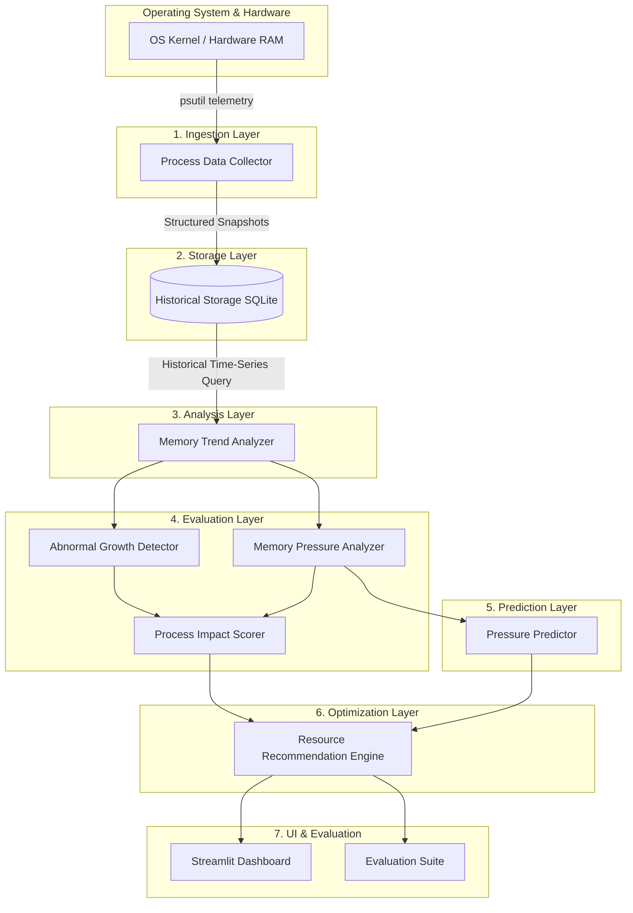

# System Architecture: Predictive Memory Optimizer

This document describes the modular architectural design, data pipelines, module interactions, and safety guarantees of the system.

---

## 1. High-Level Dataflow Pipeline

The system is organized into decoupled layers, ensuring that data collection, storage, mathematical analysis, heuristic evaluation, and user presentation remain strictly isolated from one another.

---

## 2. Module Responsibilities

| Module Directory | Primary Role | Inputs | Outputs |
|---|---|---|---|
| `src/collector/` | Gathers instantaneous OS telemetry and process attributes safely (handling PID reuse and access restrictions). | Hardware & OS (`psutil`) | Normalized process & system metric dictionaries / dataclasses |
| `src/storage/` | Manages relational storage of telemetry snapshots using SQLite with indexed time and PID fields. | Raw snapshot data from collector | Queryable historical time-series records |
| `src/analysis/` | Performs mathematical calculations: memory growth velocity ($\Delta M / \Delta t$) and persistence across time windows. | Query results from storage | Growth rate metrics, persistence ratios, time-window statistics |
| `src/detection/` | Classifies system-wide memory pressure states and flags processes exhibiting sustained growth patterns. | Analyzed time-series | System pressure state enum, growth classification flags |
| `src/prediction/` | Generates short-term forecasts for system pressure based on explainable trend regressions and moving slopes. | Historical pressure trajectory | Projected future pressure level and estimated time-to-threshold |
| `src/optimization/` | Evaluates impact scores and predicted pressure to produce prioritized, explainable, safe recommendations. | Impact scores, predicted pressure | Ordered advisory actions with reasoning strings |
| `src/dashboard/` | Provides an interactive, visual interface for humans to review metrics and recommendations. | Analysis, predictions & recommendations | Visual charts, tables, alert banners |

---

## 3. Storage Schema Design (Planned for Phase 2)

The database design uses two clean relational tables:

1. **`system_snapshots`**:
   - `id`: INTEGER PRIMARY KEY AUTOINCREMENT
   - `timestamp`: REAL (Unix epoch timestamp)
   - `total_ram_mb`: REAL
   - `available_ram_mb`: REAL
   - `used_ram_mb`: REAL
   - `percent_used`: REAL

2. **`process_snapshots`**:
   - `id`: INTEGER PRIMARY KEY AUTOINCREMENT
   - `system_snapshot_id`: INTEGER (Foreign key referencing `system_snapshots.id`)
   - `timestamp`: REAL
   - `pid`: INTEGER
   - `name`: TEXT
   - `rss_mb`: REAL (Resident Set Size in Megabytes)
   - `vms_mb`: REAL (Virtual Memory Size in Megabytes)
   - `cpu_percent`: REAL
   - `num_threads`: INTEGER
   - `status`: TEXT

---

## 4. Architectural Invariants & Safety Guarantees

1. **Read-Only Telemetry**: The collector component only queries system state via standard OS APIs. It never modifies process state.
2. **Graceful Exception Handling**: Individual processes on modern OSs frequently spawn or exit between sampling intervals. Telemetry collection must gracefully catch `NoSuchProcess`, `AccessDenied`, and `ZombieProcess` exceptions without terminating the collector loop.
3. **Decoupled Architecture**: Analysis, prediction, and recommendation components rely strictly on abstract data interfaces (clean Python dictionaries or dataclasses), allowing easy testing with mock data without needing a live system.
4. **Transparent Explainability**: Every score or recommendation includes an explicit string justification stating the exact contributing variables.
